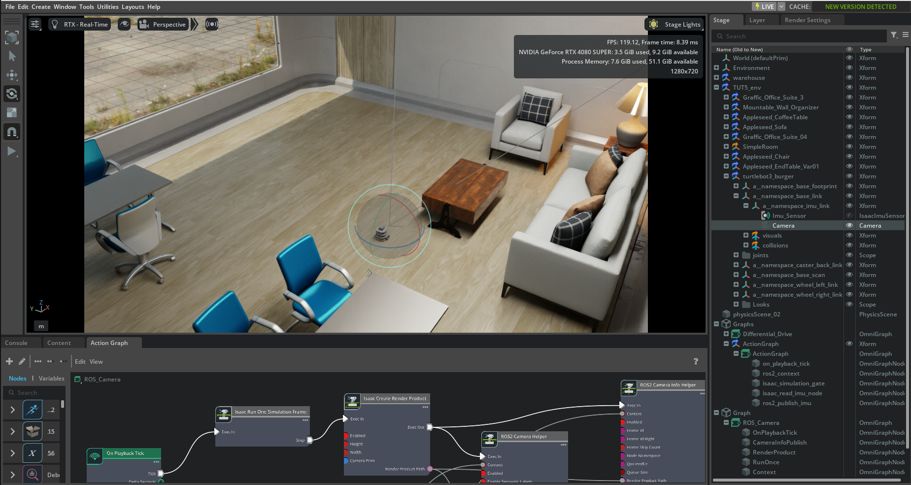

# VIO-LIO-Syntetic-IsaacSim

This mini-project aims to test Visual-Inertial Odometry (VIO) and LiDAR-Inertial Odometry (LIO) models on synthetic sensor data generated with Isaac Sim.

The tested models are Open-VINS and LIO-SAM.

 

## Testing OpenVINS on synthetic monocular camera and IMU data generated in Isaac Sim

 

<b>OpenVINS on Isaac Sim Data – RViz Visualization
</b> 

 

<b>Isaac Sim Configuration
</b> 

 

## Testing OpenVINS on synthetic monocular camera and IMU data generated in Isaac Sim

 

