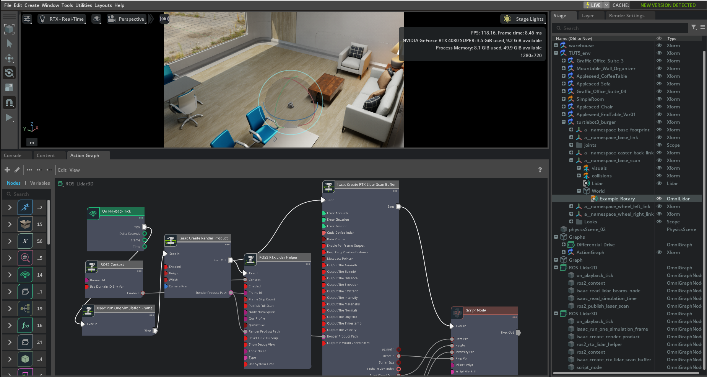

# VIO-LIO-Syntetic-IsaacSim*

This mini-project is still a work in progress.

It aims to test Visual-Inertial Odometry (VIO) and LiDAR-Inertial Odometry (LIO) models on synthetic sensor data generated with Isaac Sim.

The tested models are Open-VINS and LIO-SAM.

 

## Testing OpenVINS on synthetic monocular camera and IMU data generated in Isaac Sim

 

<b>OpenVINS on Isaac Sim Data – RViz Visualization
</b> 

 

<b>Isaac Sim Configuration
</b> 

 

## Testing LIO-SAM on synthetic LiDAR-inertial data generated in Isaac Sim

 

LIO-SAM expects LiDAR point clouds in a specific format, including additional fields such as "intensity" and "ring" (laser channel index). 
However, the RTX LiDAR in Isaac Sim typically outputs a simpler PointCloud2 message that does not fully match these requirements. 

As a result, a preprocessing step is needed to adapt the simulated data to LIO-SAM’s expected input format. This involves augmenting the point cloud with the missing fields by computing or extracting them. 
This adaptation is currently a work in progress.

 

<b>Isaac Sim Configuration
</b> 

